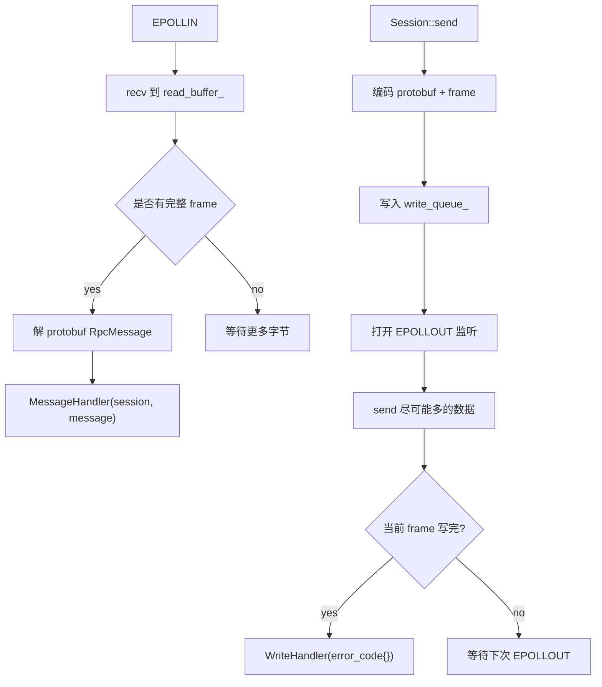
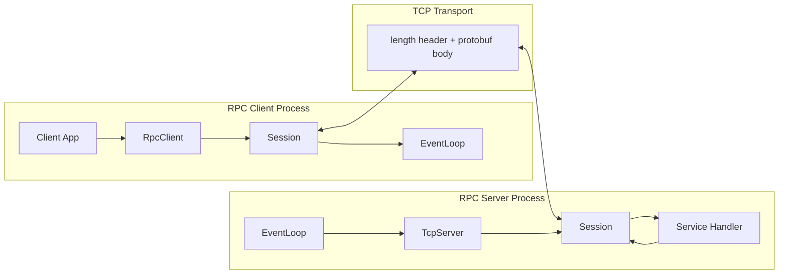
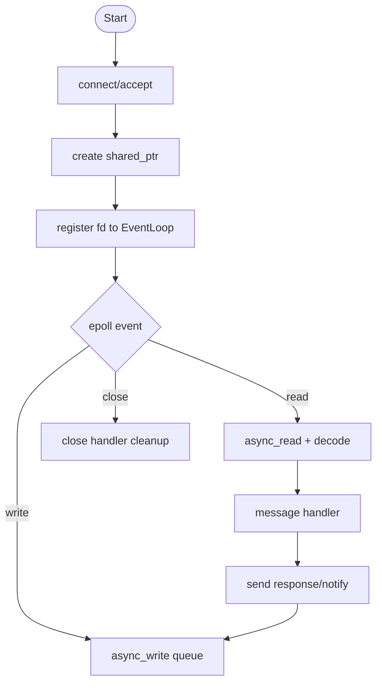

# Mini RPC 技术文档

## 目标

本项目实现一个学习型 C++ Mini RPC：

- 使用 TCP 长连接承载 RPC 消息。
- 采用 protobuf wire-format 传输 `RpcMessage`，协议定义见 `proto/rpc.proto`。
- 使用 4 字节大端长度头解决 TCP 粘包/半包。
- `Session` 继承 `std::enable_shared_from_this`，异步回调捕获 `shared_ptr` 延长生命周期。
- 基于 `epoll` 的 `EventLoop` 实现异步读写，提高多连接并发能力。
- 客户端和服务端都能主动发送消息，实现双端全通信。
- 通过 message/write/close handler 回调完成业务分发、写完成通知和资源清理。

## 目录结构

```text
.
├── CMakeLists.txt
├── proto/rpc.proto
├── include/minirpc
│   ├── client.hpp
│   ├── event_loop.hpp
│   ├── framing.hpp
│   ├── message.hpp
│   ├── protobuf_wire.hpp
│   ├── server.hpp
│   └── session.hpp
├── src
│   ├── client.cpp
│   ├── event_loop.cpp
│   ├── message.cpp
│   ├── protobuf_wire.cpp
│   ├── server.cpp
│   └── session.cpp
├── examples
│   ├── client_main.cpp
│   └── server_main.cpp
├── tests/protocol_tests.cpp
└── docs
    ├── architecture.mmd
    ├── flowchart.mmd
    └── technical_design.md
```

## 协议设计

传输帧格式：

```text
+----------------------+-----------------------------+
| uint32 body_size(BE) | protobuf RpcMessage body    |
+----------------------+-----------------------------+
```

`RpcMessage` 字段：

```proto
message RpcMessage {
  enum Kind {
    UNKNOWN = 0;
    REQUEST = 1;
    RESPONSE = 2;
    NOTIFY = 3;
    HEARTBEAT = 4;
  }

  uint64 id = 1;
  Kind kind = 2;
  string service = 3;
  string method = 4;
  bytes payload = 5;
  int32 status = 6;
  string error = 7;
}
```

说明：

- `REQUEST`：客户端或服务端发起调用，`id` 标识请求。
- `RESPONSE`：响应同一个 `id` 的请求。
- `NOTIFY`：无需响应的单向推送，可由任意一端发起。
- `payload`：业务数据，本示例用字符串演示，真实项目可继续嵌套 protobuf。

当前代码内置 `ProtobufWireCodec`，对 `proto/rpc.proto` 做最小 protobuf wire-format 编解码，因此不依赖本机安装 `protoc`。如果环境已有官方 Protobuf，可把该 codec 替换为 `protoc` 生成的 `rpc.pb.cc`。

## 核心组件

### EventLoop

`EventLoop` 封装：

- `epoll`：监听 listener/session socket 的可读、可写、关闭事件。
- `eventfd`：唤醒事件循环，支持其他线程安全 `post` 任务。
- `post(task)`：把跨线程任务切回 I/O 线程执行，比如 `Session::send`。

### Session

`Session` 是连接级对象，负责：

- 非阻塞 socket 读写。
- 读缓冲解析完整 frame。
- protobuf body 编解码。
- 写队列缓存未发送完成的数据。
- 触发 message/write/close handler。

生命周期关键点：

```cpp
class Session : public std::enable_shared_from_this<Session> {
    void start() {
        auto self = shared_from_this();
        loop_.add(socket_fd_, EPOLLIN | EPOLLRDHUP, [self](std::uint32_t events) {
            self->handle_events(events);
        });
    }
};
```

异步回调捕获 `self` 后，即使外部临时引用释放，`Session` 也会活到回调执行完成。服务端还会在 `sessions_` 中保存 `shared_ptr`，便于广播或主动发送消息。

### TcpServer

服务端流程：

1. 创建监听 socket。
2. `EventLoop` 监听 `EPOLLIN`。
3. `accept4` 接受新连接。
4. 为每个连接创建 `shared_ptr<Session>`。
5. 注册业务 message handler。
6. 业务 handler 收到 `REQUEST` 后构造 `RESPONSE` 并调用 `Session::send`。

### RpcClient

客户端封装：

- `connect(host, port)` 创建 `Session`。
- `call_async(service, method, payload, callback)` 发起异步请求。
- `notify(service, method, payload)` 主动推送消息。
- `pending_` 保存 `id -> callback`，收到 `RESPONSE` 后按 `id` 回调。

## Handler 回调机制

项目中涉及三类 handler：

| Handler | 触发时机 | 用途 |
| --- | --- | --- |
| `MessageHandler` | 收到完整 protobuf 消息后 | 业务分发、请求响应、通知处理 |
| `WriteHandler` | 某个 frame 写完成或失败后 | 写结果通知、日志、失败清理 |
| `CloseHandler` | socket 关闭后 | 从连接表移除 Session、清空 pending 回调 |

这种设计把网络 I/O 与业务逻辑拆开，RPC 框架只负责连接、协议和调度，业务层只关注消息语义。

## 双端全通信

TCP 连接建立后，两端都拥有一个 `Session`：

- 客户端可以发送 `REQUEST`，服务端返回 `RESPONSE`。
- 客户端可以发送 `NOTIFY`，服务端只处理不响应。
- 服务端可以在连接建立时主动发送 `NOTIFY` 给客户端。
- 读事件和写事件独立处理，一端正在发送时另一端仍可接收消息。

## 异步读写流程



## 架构图

架构图源码见 `docs/architecture.mmd`。



## 流程图

流程图源码见 `docs/flowchart.mmd`。



## 可扩展方向

- 使用官方 Protobuf 生成 `rpc.pb.h/.cc` 替换内置 codec。
- 增加服务注册表：`service.method -> handler`。
- 增加超时、重试、心跳和连接池。
- 增加线程池，把 CPU 密集型业务从 I/O 线程移走。
- 支持 TLS、压缩、鉴权、trace id。

